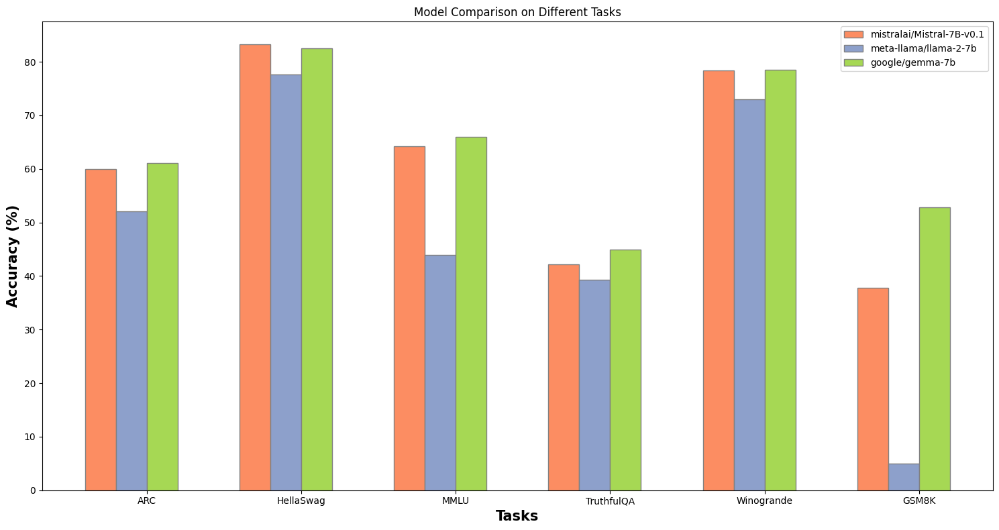

## Abstract

We present a straightforward approach to adapting small, open-source models for specialized use-cases, that can surpass GPT 3.5 performance with RAG. With it, we were able to get superior results on Q&A over [technical documentation](https://nitro.jan.ai/docs) describing a small [codebase](https://github.com/janhq/nitro).

In short, (1) extending a general foundation model like Mistral with strong math and coding, and (2) training it over a high-quality, synthetic dataset generated from the intended corpus, and (3) adding RAG capabilities, can lead to significant accuracy improvements.

Problems still arise with catastrophic forgetting in general tasks, commonly observed during continued fine-tuning [1]. In our case, this is likely exacerbated by our lack of access to Mistral’s original training dataset and various compression techniques used in our approach to keep the model small.

## Selecting a strong foundation model

Mistral 7B continues to outshine [Meta's Llama-2 7B](https://huggingface.co/meta-llama/Llama-2-7b) and [Google's Gemma 7B](https://huggingface.co/google/gemma-7b) on meaningful benchmarks, so we selected this as a starting point. 

Having a robust base model is critical. In our experiments, using Mistral as a starting point ensured the highest accuracy for subsequent specialized adaptations.

*Figure 1. Mistral 7B excels in benchmarks, ranking among the top foundational models.*

*Note: we are not sponsored by the Mistral team. Though many folks in their community do like to run Mistral locally using our desktop client - [Jan](https://jan.ai/).*