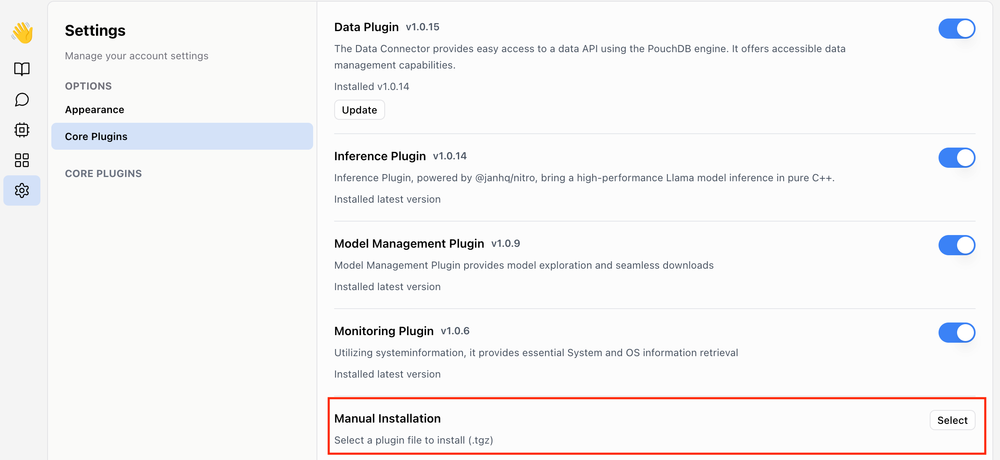

# Build and publish an app
Apps let you extend Obsidian with your own features to create a custom note-taking experience.
In this tutorial, you'll compile a sample plugin from source code and load it into Obsidian.

## What you'll learn
After you've completed this tutorial, you'll be able to:
- Configure an environment for developing Jan apps.
- Compile a app from source code.
- Reload a app after making changes to it.

## Prerequisites
To complete this tutorial, you'll need:
- [Git](https://git-scm.com/) installed on your local machine.
- A local development environment for [Node.js](https://node.js.org/en/about/).
- A code editor, such as [Visual Studio Code](https://code.visualstudio.com/).

## Before you start 
When developing apps, one mistake can lead to unintended changes to your app. Please backup the data.

## Development
### Step 1: Download the sample plugin
- Go to [Jan sample app](https://github.com/janhq/jan-sample-app)
- Select `Use this template button` at the top of the repository
- Select `Create a new repository`
- Select an owner and name for your new repository
- Click `Create repository`
- Clone your new repository
- Start developing locally

### Step 2: Initial Setup

After you've cloned the repository to your local machine or codespace, you'll need to perform some initial setup steps before you can develop your plugin.

> [!NOTE]
>
> You'll need to have a reasonably modern version of
> [Node.js](https://nodejs.org) handy. If you are using a version manager like
> [`nodenv`](https://github.com/nodenv/nodenv) or
> [`nvm`](https://github.com/nvm-sh/nvm), you can run `nodenv install` in the
> root of your repository to install the version specified in
> [`package.json`](./package.json). Otherwise, 20.x or later should work!

1. :hammer_and_wrench: Install the dependencies

   ```bash
   npm install
   ```

1. :building_construction: Package the TypeScript for distribution

   ```bash
   npm run bundle
   ```

1. :white_check_mark: Check your artifact

   There will be a tgz file in your plugin directory now

### Step 3: Update the Plugin Metadata

The [`package.json`](package.json) file defines metadata about your plugin, such as
plugin name, main entry, description and version.

When you copy this repository, update `package.json` with the name, description for your plugin.

### Step 4: Update the Plugin Code

The [`src/`](./src/) directory is the heart of your plugin! This contains the
source code that will be run when your plugin extension functions are invoked. You can replace the
contents of this directory with your own code.

There are a few things to keep in mind when writing your plugin code:

- Most Jan Plugin Extension functions are processed asynchronously.
  In `index.ts`, you will see that the extension function will return a `Promise<any>`.

  ```typescript
  import { core } from "@janhq/core";

  function onStart(): Promise<any> {
    return core.invokePluginFunc(MODULE_PATH, "run", 0);
  }
  ```

  For more information about the Jan Plugin Core module, see the
  [documentation](https://github.com/janhq/jan/blob/main/core/README.md).

So, what are you waiting for? Go ahead and start customizing your plugin!

## App installation

- `Select` the built `*.tar.gz` file
- The App will reload after new app get installed

## App uninstallation
To be updated

## App update
To be updated

## App publish
After you have completed with local app development and want to publish to `Jan marketplace` for other to reuse, please follow the following steps
- Update your local `package.json` and configure `npm login` correctly
- Run `npm publish` and set to public NPM package (so that other can install) - Please refer to our example [NPM retrieval plugin](https://www.npmjs.com/package/retrieval-plugin)
- Go to `Jan plugin catalog`(https://github.com/janhq/plugin-catalog) and create a `Pull request` for new `App artifact` (which is a renamed version of your App `package.json`) - Please refer to example [retrieval-plugin](https://github.com/janhq/plugin-catalog/blob/main/retrieval-plugin.json)
- We at Jan will be responsible to review and merge to `main`
- Once your new app is on `main`, you and other Jan users can find it in `Jan marketplace`